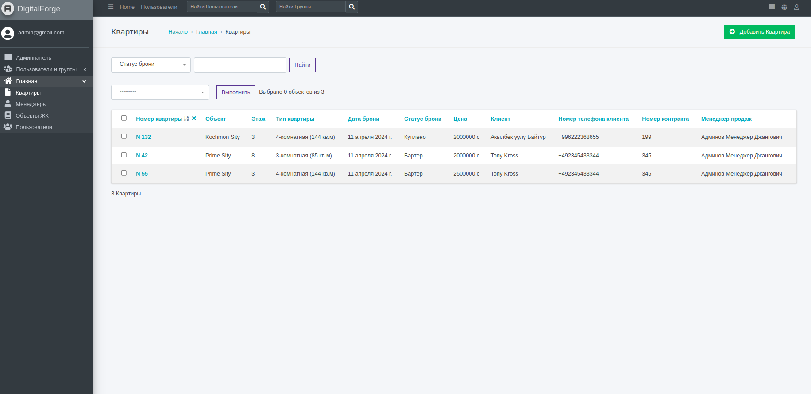
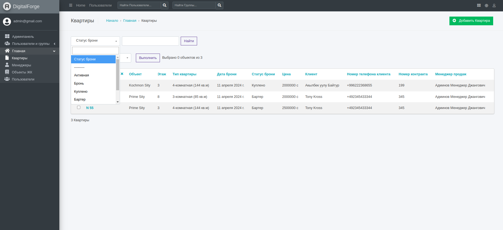
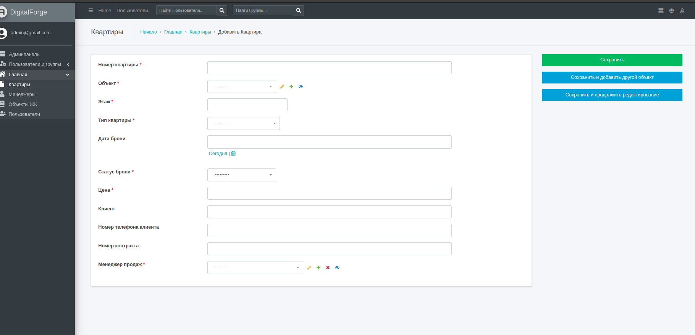
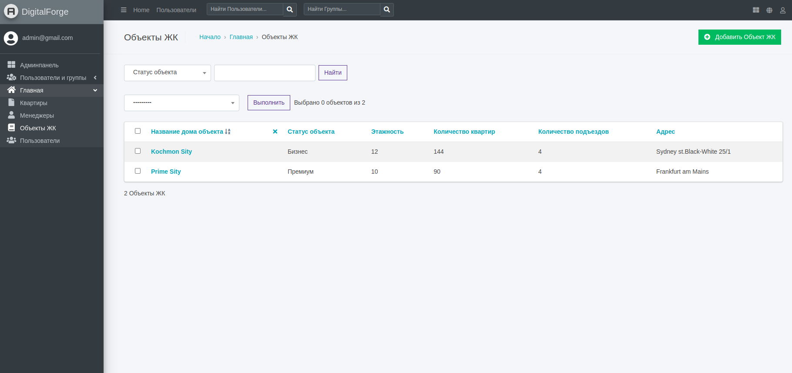
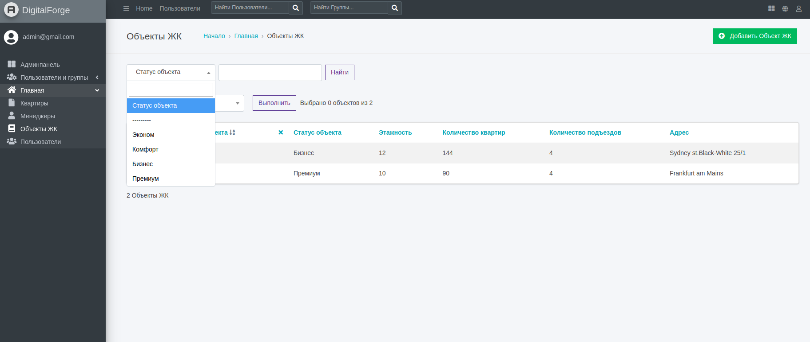
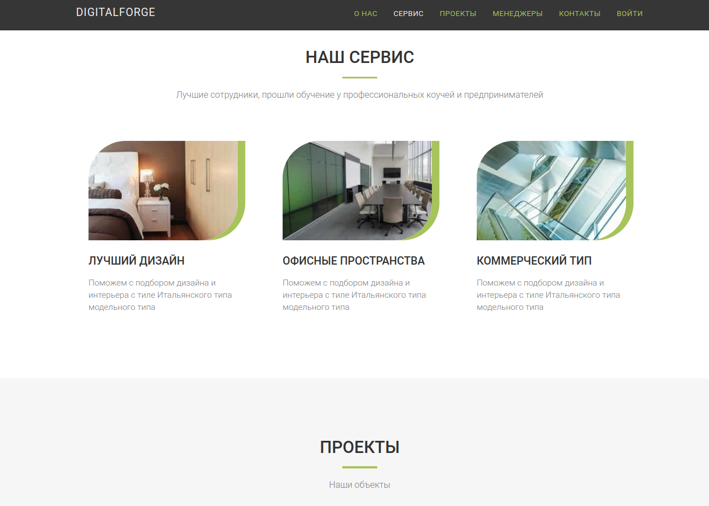
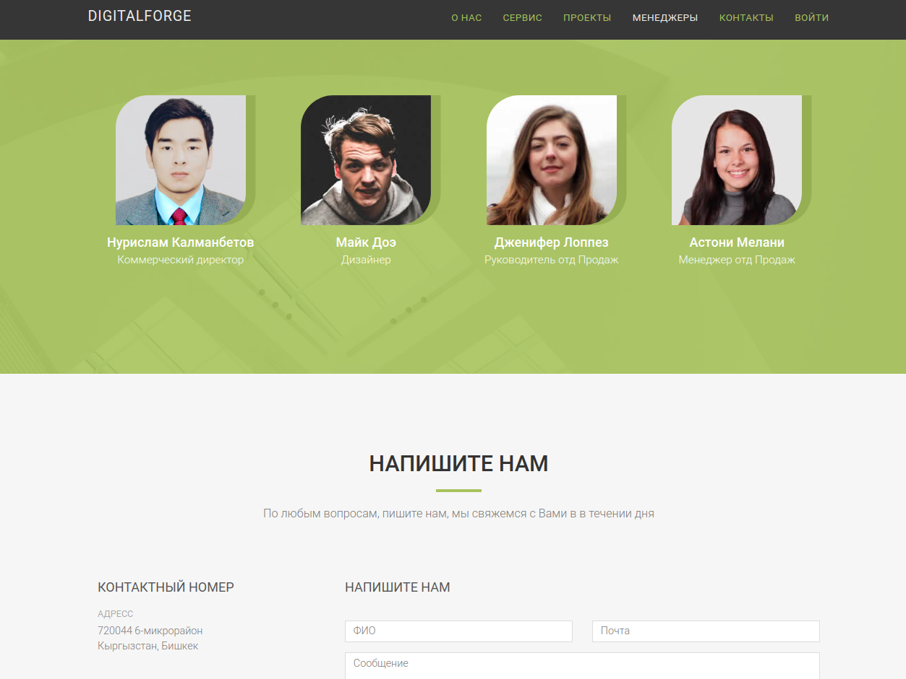

# DIGITALFORGE - test project
DIGITALFORGE - test project

<b>Development Version</b>

<ol>
  <li>Copy .env-example and paste environment variables in .env file with your values</li>
  <li>Change direction to the folder with <b>docker-compose.yml</b> file</li>
  <li>Run the command: <b>docker-compose up -d --build</b></li>
  <li>Run the command: <b>docker-compose exec app python3.6 manage.py migrate</b></li>
  <li>Create a superuser account with the command: <b>docker-compose exec app python3.6 manage.py createsuperuser</b></li>
  <li>Browse to one of the following links:       http://127.0.0.1:8000       http://localhost:8000</li>
</ol>

<b>Production Version</b>

<ol>
  <li>First of all, go to the <b>settings.py</b> file and change DEBUG option to False   DEBUG = False</li>
  <li>Then change direction to the folder with <b>docker-compose.yml</b> file</li>
  <li>Run the command: <b>docker-compose -f production.yml up -d --build</b></li>
  <li>Create a superuser account with the command: <b>docker-compose -f production.yml exec app python3.6 manage.py createsuperuser</b>. 
  But be careful. If you see message about unapplied migrations, type <b>Ctrl+C</b> to exit from operation. Wait till project applied migrations automatically. After 15-20 seconds try to run the command again, and if there won't be any messages or warnings, create superuser account.</li>
  <li>Browse to one of the following links:       http://127.0.0.1       http://localhost</li>
</ol>

